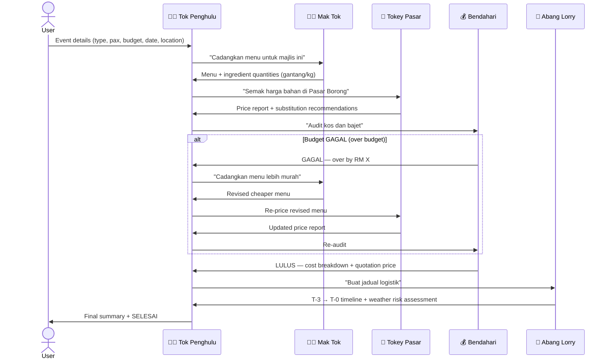
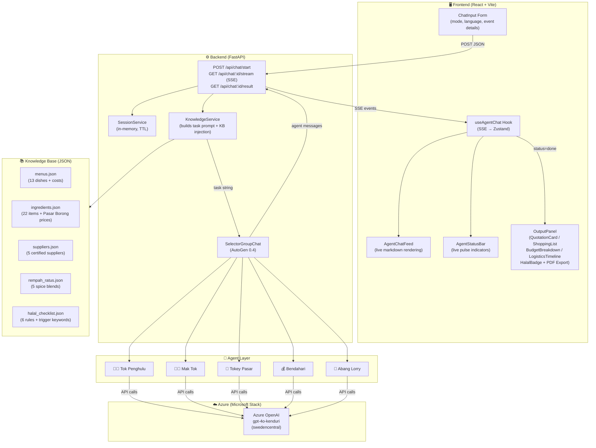

# 🍛 KenduriLuhh

> **AI-Powered Multi-Agent System for Smart Catering Operations**  
> Submission for **iNextLabs Problem Statement** — Code; Without Barriers Hackathon 2026  
> Hacking Period: 2 April – 3 May 2026

---

## 🏆 What is KenduriLuhh?

KenduriLuhh is a multi-agent AI system that automates Malaysian catering operations end-to-end.  
Five specialized AI agents — each with a distinct role — collaborate in real time to turn a simple event request into a complete, actionable catering plan: menu, ingredient costs, budget audit, logistics timeline, and a downloadable quotation.

The name "KenduriLuhh" blends **kenduri** (Malay for feast/communal gathering) with the Malaysian slang suffix **"luhh"** — meaning "obviously" or "of course" — because of *course* your catering should be this smart.

---

## 💡 The Problem We Solve

Malaysian catering businesses manage complex workflows manually across disconnected tools:

| Pain Point | Impact |
|---|---|
| Manual quotation drafting | Hours per booking, inconsistent pricing |
| No ingredient cost tracking | Margin erosion, surprise over-budget |
| Ad-hoc logistics planning | Late deliveries, food safety risks (santan spoilage) |
| No halal verification workflow | Compliance gaps |
| DIY kenduri with no guidance | Pembaziran (wastage), makanan tak cukup |

KenduriLuhh solves all five with a **digital team of AI agents that debate, negotiate, and produce structured outputs**.

---

## 🤖 The Five Agents (The Digital Team)

| Agent | Role | Persona |
|---|---|---|
| 👴🏽 **Tok Penghulu** | Orchestrator / Manager | The village head — coordinates the whole team, opens each case, and signs off with `SELESAI` |
| 👵🏽 **Mak Tok** | Menu Planner & Chef | 40-year veteran of Malay & Indian Muslim cuisine — calculates portions in gantang & cupan |
| 🛒 **Tokey Pasar** | Procurement & Inventory | Knows every price at Pasar Borong Selayang & Pudu — flags `⚠️ MAHAL` and suggests substitutes |
| 💰 **Bendahari** | Financial Controller | The strict auditor — approves (`LULUS`) or rejects (`GAGAL`) budgets, calculates profit margins |
| 🚛 **Abang Lorry** | Logistics Coordinator | Plans T-3 to T-0 prep timeline, flags weather & traffic risks, schedules 3AM Pasar Borong runs |

### Agent Collaboration Flow



---

## 🏗️ System Architecture



---

## 🎯 Two Operating Modes

### 🏢 Katering Pro
*For professional catering businesses*
- Input: Event details + target profit margin
- Output: **Professional PDF Quotation** with itemised costs, margin calculation, supplier schedule
- Agents focus on: margin optimisation, bulk procurement, staff scheduling

### 🏡 Rewang DIY
*For families organising a community kenduri (gotong-royong)*
- Input: Event details, no profit margin needed
- Output: **Shopping List** in household measurements (gantang, cupan, biji) + cooking schedule
- Agents focus on: cost minimisation, Mydin/Pasar Malam sourcing, zero-waste planning

---

## ✨ Key Features

### 🧠 Intelligent Multi-Agent Negotiation
Agents actively debate. If Bendahari rejects the budget, Mak Tok proposes a cheaper menu, Tokey Pasar re-prices it, and Bendahari re-audits — all automatically, without human intervention.

### 📚 Knowledge Base (RAG-style)
Five curated JSON knowledge bases are injected into agent prompts at runtime:
- **Real Pasar Borong prices** (April 2026, Selayang & Pudu)
- **Malaysian recipe database** with portion calculations
- **Halal compliance rules** with trigger keyword detection
- **Spice blend ratios** (rempah ratus) for authentic Malay cooking
- **Supplier profiles** with halal certification status

### 🔴 Live Agent Debate UI
- Real-time SSE streaming — see each agent's message as it's generated
- Pulsing status chips show which agent is currently "thinking"
- Split-screen: agent log (left) + live summary panel (right)
- When done: OutputPanel slides in with structured results

### 🌐 Bilingual Support
Full English / Bahasa Malaysia toggle. The language choice propagates through the task string and every agent's system prompt — all 5 agents respond consistently in the chosen language.

### 📄 PDF Export
One-click download generates a formatted A4 PDF:
- **Katering mode**: Professional quotation with cost breakdown
- **Rewang mode**: Printable shopping list with checkboxes

### 🕌 Halal Verification
Automatic halal detection across all agent messages. Mak Tok's system prompt enforces halal substitutions (e.g. cooking wine → cuka putih/asam jawa). HalalBadge displayed on final output.

### 📊 Budget Breakdown Chart
Recharts horizontal bar chart showing ingredient cost, overhead, labour, transport, and profit margin — built from Bendahari's structured financial report.

### ⏱️ Logistics Timeline
T-3 to T-0 preparation schedule extracted from Abang Lorry's output, displayed as an animated vertical timeline. Weather risk flagging for monsoon season and flood-prone areas (Shah Alam, Klang).

---

## 🛠️ Tech Stack

### Microsoft / Azure Stack
| Component | Technology |
|---|---|
| **Agent Framework** | Microsoft AutoGen 0.4 (`autogen-agentchat`, `autogen-ext[azure]`) |
| **LLM** | Azure OpenAI — `gpt-4o` (deployment: `gpt-4o-kenduri`, Sweden Central) |
| **Orchestration** | `SelectorGroupChat` with custom LLM-driven selector prompt |

### Backend
| Component | Technology |
|---|---|
| API Server | FastAPI 0.115 + Uvicorn |
| Streaming | Server-Sent Events (SSE) via `sse-starlette` |
| Validation | Pydantic v2 with prompt injection protection |
| Session Store | In-memory with TTL (Redis-ready) |
| Knowledge Base | 5 curated JSON files, injected at runtime |

### Frontend
| Component | Technology |
|---|---|
| Framework | React 19 + TypeScript + Vite 8 |
| Styling | Tailwind CSS v4 + Playfair Display / Inter fonts |
| State Management | Zustand |
| Animations | Framer Motion |
| Charts | Recharts |
| Markdown | react-markdown + remark-gfm |
| PDF Export | jsPDF |
| Icons | Lucide React |

---

## 📁 Project Structure

```
KenduriLuhh/
├── backend/
│   ├── app/
│   │   ├── agents/
│   │   │   ├── base_agent.py          # All 5 system prompts + language enforcement
│   │   │   ├── group_chat.py          # SelectorGroupChat orchestration
│   │   │   ├── tok_penghulu.py        # Orchestrator agent factory
│   │   │   ├── mak_tok.py             # Menu planner agent factory
│   │   │   ├── tokey_pasar.py         # Procurement agent factory
│   │   │   ├── bendahari.py           # Financial controller agent factory
│   │   │   └── abang_lorry.py         # Logistics agent factory
│   │   ├── api/routes/
│   │   │   ├── chat.py                # POST /start · GET /stream · GET /result
│   │   │   ├── health.py              # GET /health
│   │   │   └── knowledge.py           # GET /knowledge/*
│   │   ├── knowledge_base/
│   │   │   ├── menus.json             # 13 Malaysian dishes with costs & portions
│   │   │   ├── ingredients.json       # 22 ingredients with Pasar Borong prices
│   │   │   ├── suppliers.json         # 5 halal-certified suppliers
│   │   │   ├── rempah_ratus.json      # 5 spice blends with ratios
│   │   │   └── halal_checklist.json   # 6 halal rules + trigger keywords
│   │   ├── models/
│   │   │   ├── request_models.py      # CateringRequest (Pydantic + injection protection)
│   │   │   └── response_models.py     # Response schemas
│   │   ├── services/
│   │   │   ├── knowledge_service.py   # KB loader + task string builder (EN/BM)
│   │   │   └── session_service.py     # In-memory session store with TTL
│   │   ├── config.py                  # Pydantic settings (reads .env)
│   │   └── main.py                    # FastAPI app entry point
│   ├── .env.example
│   └── requirements.txt
│
└── frontend/
    └── src/
        ├── components/
        │   ├── AgentChatFeed.tsx       # Live chat bubbles with markdown rendering
        │   ├── AgentStatusBar.tsx      # 5 pulsing agent status chips
        │   ├── ChatInput.tsx           # Event form with mode + language toggle
        │   ├── ModeToggle.tsx          # Katering Pro / Rewang DIY slider
        │   └── outputs/
        │       ├── OutputPanel.tsx     # Orchestrates all output components
        │       ├── QuotationCard.tsx   # Katering: PDF-ready quotation
        │       ├── ShoppingList.tsx    # Rewang: checkboxed shopping list
        │       ├── BudgetBreakdown.tsx # Recharts horizontal bar chart
        │       ├── LogisticsTimeline.tsx # T-3 → T-0 animated timeline
        │       └── HalalBadge.tsx      # Halal verification badge
        ├── hooks/
        │   └── useAgentChat.ts        # SSE hook → Zustand store
        ├── store/
        │   └── chatStore.ts           # Global state (messages, status, agents)
        ├── utils/
        │   ├── parseMessages.ts       # Agent message → structured data parser
        │   └── generatePdf.ts         # jsPDF quotation/shopping list generator
        └── types/
            └── index.ts               # Shared TypeScript types
```

---

## 🚀 Getting Started

### Prerequisites
- Python 3.11+
- Node.js 20+
- Azure OpenAI resource with a `gpt-4o` deployment

### 1. Clone & Setup Backend

```bash
git clone https://github.com/snsyaqirah/kenduriluhh.git
cd kenduriluhh/backend

python -m venv venv
source venv/Scripts/activate   # Git Bash / Mac/Linux
# venv\Scripts\activate        # Windows CMD

pip install -r requirements.txt
pip install tiktoken
```

### 2. Configure Environment

```bash
cp .env.example .env
```

Edit `.env`:
```env
AZURE_OPENAI_API_KEY=your-key-here
AZURE_OPENAI_ENDPOINT=https://your-resource.openai.azure.com/
AZURE_OPENAI_DEPLOYMENT=gpt-4o-kenduri
AZURE_OPENAI_API_VERSION=2025-01-01-preview
CORS_ORIGINS=http://localhost:5173,http://localhost:3000
SESSION_TTL_SECONDS=3600
MAX_PAX=5000
```

### 3. Start Backend

```bash
PYTHONUTF8=1 uvicorn app.main:app --reload --port 8000
```

Backend runs at `http://localhost:8000` · API docs at `http://localhost:8000/docs`

### 4. Setup & Start Frontend

```bash
cd ../frontend
npm install
npm run dev
```

Frontend runs at `http://localhost:5173`

---

## 🔌 API Reference

| Method | Endpoint | Description |
|---|---|---|
| `GET` | `/api/health` | Health check + agent status |
| `POST` | `/api/chat/start` | Create planning session, returns `session_id` |
| `GET` | `/api/chat/{id}/stream` | SSE stream — live agent messages |
| `GET` | `/api/chat/{id}/result` | Poll for completed result |
| `GET` | `/api/knowledge/menus` | List all menu items |
| `GET` | `/api/knowledge/ingredients` | List ingredients with prices |
| `GET` | `/api/knowledge/suppliers` | List halal-certified suppliers |

### Example Request

```bash
curl -X POST http://localhost:8000/api/chat/start \
  -H "Content-Type: application/json" \
  -d '{
    "mode": "katering",
    "language": "en",
    "event_type": "Corporate Dinner",
    "pax": 200,
    "budget_myr": 10000,
    "event_date": "2026-05-10",
    "event_location": "Shah Alam, Selangor",
    "dietary_notes": "Halal only",
    "profit_margin_percent": 20
  }'
```

---

## 🔐 Security

- **Prompt injection protection** — all user-supplied strings are sanitised with regex before entering agent prompts
- **Input validation** — Pydantic models with field-level constraints (max pax: 5000, future dates only)
- **CORS** — whitelist-based origin control
- **Secrets** — Azure keys stored in `.env` (gitignored), never in source code
- **Session TTL** — sessions auto-expire after 1 hour

---

## 🗓️ Build Log

| Day | Date | What We Built |
|---|---|---|
| 1 | Apr 22 | Project setup, venv, AutoGen 0.4, config, 5 agent system prompts, test connection |
| 2 | Apr 22 | All 5 agent factories, SelectorGroupChat, stress test passes |
| 3 | Apr 22 | 5 Knowledge Base JSONs, knowledge_service, session_service, Pydantic models, FastAPI server live |
| 4 | Apr 22 | SSE streaming, agent loop bug fixes, selector logic hardened, MaxMessage cap |
| 5 | Apr 22 | React frontend — Vite + Tailwind + Zustand, AgentChatFeed, ChatInput, ModeToggle, useAgentChat hook |
| 6 | Apr 22 | Output components — QuotationCard, ShoppingList, BudgetBreakdown (Recharts), LogisticsTimeline, HalalBadge, PDF export |
| 7–8 | Apr 23 | Language system (EN/BM hard enforcement), markdown rendering, PDF generation (jsPDF), chart redesign |
| 9 | Apr 24 | README + architecture diagrams, full documentation |
| 10 | Apr 25 | Demo video, final submission |

---

## 👩‍💻 Team

**Syaqirah** — Intelligent Systems Engineering student  
Building KenduriLuhh as part of a broader wedding planning platform ecosystem (**PlanLuhh** — coming soon).

---

## 📄 License

MIT — built for the Code; Without Barriers Hackathon 2026.

---

*The Future of Rewang.* 🍛
